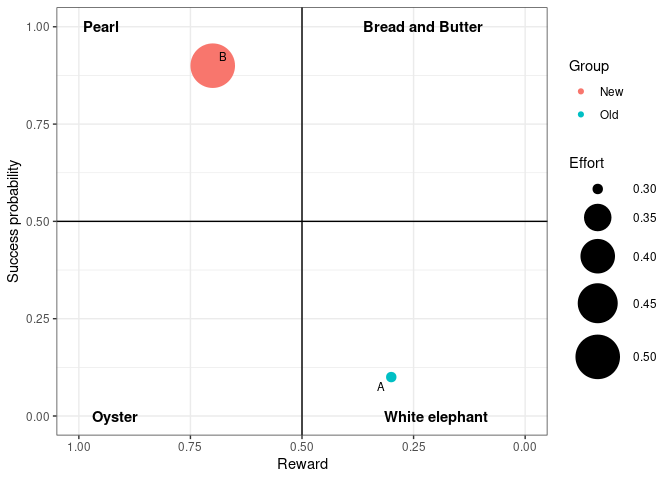

<!-- README.md is generated from README.Rmd. Please edit that file and build with devtools::build_readme() -->

# ProjectLeadRship

<!-- badges: start -->
<!-- badges: end -->

The goal of ProjectLeadRship is to provide functions to vizualise and
quantify various aspects of project leadership.

## Installation

You can install the development version of ProjectLeadRship from
[GitHub](https://github.com/) with:

``` r
# install.packages("devtools")
devtools::install_github("nalcala/ProjectLeadRship")
```

## Example

This is a basic example which shows you how to plot a risk-reward
project bubble plot

``` r
library(ProjectLeadRship)
library(tibble)

data <- tibble::tibble(Success_prob=c(0.1,0.9),Reward=c(0.3,0.7),Effort=c(0.3,0.5),Project=c("A","B"),Group=c("Old","New"))
plot_risk_reward(data)
```


